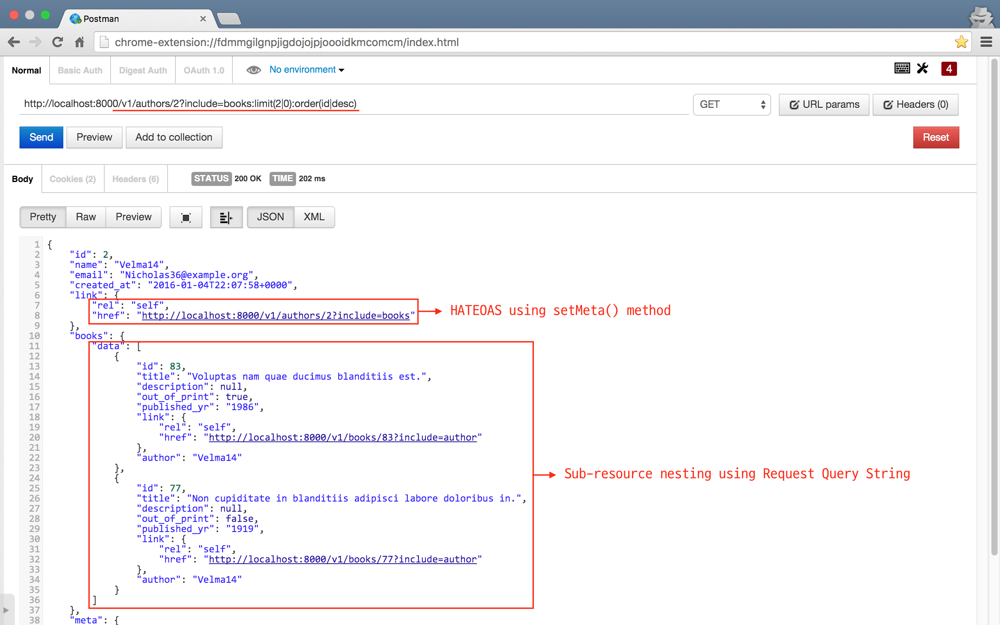

## RESTful HTTP API dev tool for Laravel or Lumen based project

[](https://packagist.org/packages/appkr/api) 
[](https://packagist.org/packages/appkr/api) 
[](https://packagist.org/packages/appkr/api) 
[](https://packagist.org/packages/appkr/api)

## INDEX

- [ABOUT](#about)
- [GOAL OF THIS PACKAGE](#goal)
- [LARAVEL/LUMEN IMPLEMENTATION EXAMPLE](#example)
- [HOW TO INSTALL](#install)
- [TRANSFORMER](#transformer)
- [CONFIG](#config)
- [APIs](#method)
- [BUNDLED EXAMPLE](#example)

---

<a name="about"></a>
## ABOUT

This package was started to fulfill a personal RESTful API service needs. And provided as a separate package, hoping users quickly build his/her RESTful HTTP API. 

<a name="goal"></a>
## GOAL OF THIS PACKAGE

1. Provides Laravel/Lumen Service Provider for the `league/fractal`.
2. Provides easy way of making transformed/serialized API response.
3. Provides make:transformer artisan command.
4. Provides configuration capability for the response format.
5. Provides examples, so that users can quickly copy &amp; paste into his/her project.

<a name="example"></a>
## LARAVEL/LUMEN IMPLEMENTATION EXAMPLE

### Define METHOD and RESOURCE in Laravel way.

```php
// app/Http/routes.php
Route::group(['prefix' => 'v1'], function () {
    Route::resource(
        'books',
        'BooksController',
        ['except' => ['create', 'edit']]
    );
});

// Lumen doesn't support RESTful resource route. You have to define them one by one.
$app->group(['prefix' => 'v1'], function ($app) {
    $app->get('books', [
        'as'   => 'v1.books.index',
        'uses' => 'BooksController@index',
    ]);
    $app->get('books/{id}', /*...*/);
    $app->post('books', /*...*/);
    $app->put('books/{id}, /*...*/);
    $app->delete('books/{id}', /*...*/);
});
```

### Fill the framework's missing feature for RESTful API

Corresponding to Laravel/Lumen route definition, you can implement your controller in RESTful fashion by injecting `Appkr\Api\Http\Response` or with `json()` Helper.

#### Use Case

```php
// app/Http/Controllers/BooksController.php

<?php

namespace App\Http\Controllers\V1;

use App\Http\Controllers\Controller;
use App\Book;
use App\Transformers\BookTransformer;
use Illuminate\Http\Request;

class BooksController extends Controller
{
    public function index()
    {
        return json()->withPagination(
            Book::latest()->paginate(5),
            new BookTransformer
        );
    }

    public function store(Request $request)
    {
        // Assumes that validation is done by a Form Request
        return json()->created(
            $request->user()->create($request->all())
        );
    }

    public function show($id)
    {
        return json()->withItem(
            Book::findOrFail($id),
            new BookTransformer
        );
    }

    public function update(Request $request, $id)
    {
        $book = Book::findOrFail($id);

        return ($book->update($request->all()))
            ? json()->success('Updated')
            : json()->error('Failed to update');
    }

    public function destroy($id)
    {
        $book = Book::findOrFail($id);

        return ($book->delete())
            ? json()->success('Deleted')
            : json()->error('Failed to delete');
    }
}
```

<a name="install"></a>
##HOW TO INSTALL

### **Setp #1:** Composer.

```bash
$ composer require "appkr/api: 0.1.*"
```

### **Step #2:** Add the service provider.

```php
// config/app.php (Laravel)
'providers'=> [
    Appkr\Api\ApiServiceProvider::class,
]

// boostrap/app.php (Lumen)
$app->register(Appkr\Api\ApiServiceProvider::class);
```

### **Step #3:** [OPTIONAL] Publish assets.

```bash
# Laravel only
$ php artisan vendor:publish --provider="Appkr\Api\ApiServiceProvider"
```

The config file is located at `config/api.php`.

Done !

<a name="transformer"></a>
## TRANSFORMER

### What?

We should implement transformers by ourselves. For more about what is it, what you can do with this, and why it is required, [see this page](http://fractal.thephpleague.com/transformers/). A recommendation is that at least 1 transformer for 1 model, e.g. `BookTransformer` for `Book`. 

### Generator

Luckily this package ships with an artisan command that conveniently generates a transformer class.

```bash
$ php artisan make:transformer {subject} {--includes=}
```

- `subject` : The string name of the model class. e.g. `App\\Book`
- `includes` : Optional list of resources to include. e.g. `--includes=App\\User:author,App\\Comment:comments:true`. If the third element is provided as true, the command will interpret the include as a collection.

**`Note`** We should always use double back slashes (`\\`), when passing a class name in artisan command.

For example:

```bash
$ php artisan make:transformer App\\Book --includes=App\\User:author,App\\Comment:comments:true
# Then, we may run make:transformer for User and Comment respectively.
```

A generated file will look like this:

```php
<?php
namespace App\Transformers;

use App\Book;
use Appkr\Api\TransformerAbstract;
use League\Fractal;
use League\Fractal\ParamBag;

class BookTransformer extends TransformerAbstract
{
    /**
     * List of resources possible to include using url query string.
     * e.g. collection case -> ?include=comments:limit(5|1):order(created_at|desc)
     *      item case       -> ?include=author
     *
     * @var  array
     */
    protected $availableIncludes = ['author', 'comments'];

    /**
     * List of resources to include automatically/always.
     *
     * @var  array
     */
    // protected $defaultIncludes = ['author', 'comments'];
    
    /**
     * Transform single resource.
     *
     * @param  \App\Book $book
     * @return  array
     */
    public function transform(Book $book)
    {
        return [
            'id' => (int) $book->id,
            // ...
            'created' => $book->created_at->toIso8601String(),
            'link' => [
                 'rel' => 'self',
                 'href' => route('api.v1.books.show', $book->id),
            ],
        ];
    }

    /**
     * Include author.
     *
     * @param  \App\Book $book
     * @return  \League\Fractal\Resource\Item
     */
    public function includeAuthor(Book $book)
    {
        return $this->item($book->author, new \App\Transformers\UserTransformer);
    }        
    
    /**
     * Include comments.
     *
     * @param  \App\Book $book
     * @param  \League\Fractal\ParamBag|null $params
     * @return  \League\Fractal\Resource\Collection
     */
    public function includeComments(Book $book, $params)
    {
        list($limit, $offset, $orderCol, $orderBy) = $this->calculateParams($params);

        $comments = $book->comments()->limit($limit)->offset($offset)->orderBy($orderCol, $orderBy)->get();

        return $this->collection($comments, new \App\Transformers\CommentTransformer);
    }
}
```

<a name="config"></a>
## CONFIG

Skim through the [`config/api.php`](https://github.com/appkr/api/blob/master/src/config/api.php), which is inline documented. I think I did my best in articulating for each config.

<a name="method"></a>
## APIs

The following is the full list of response methods that `Appkr\Api\Http\Response` provides. We can use in `OurController` to format API response.

### Available Response Methods

```php
// Generic response. 
// If valid callback parameter is provided, jsonp response can be provided.
// This is a very base method. All other responses are utilizing this.
respond(array $payload);

// Respond collection of resources
// If $transformer is not given as the second argument,
// this class does its best to transform the payload to a simple array
withCollection(
    \Illuminate\Database\Eloquent\Collection $collection, 
    \League\Fractal\TransformerAbstract|null $transformer, 
    string|null $resourceKey // for JsonApiSerializer only
);

// Respond single item
withItem(
    \Illuminate\Database\Eloquent\Model $model, 
    \League\Fractal\TransformerAbstract|null $transformer, 
    string|null $resourceKey // for JsonApiSerializer only
);

// Respond collection of resources with pagination
withPagination(
    \Illuminate\Contracts\Pagination\LengthAwarePaginator $paginator, 
    \League\Fractal\TransformerAbstract|null $transformer, 
    string|null $resourceKey // for JsonApiSerializer only
);

// Respond json formatted success message
// api.php provides configuration capability
success(string|array $message);

// Respond 201
// If an Eloquent model is given at an argument,
// the class tries its best to transform the model to a simple array
created(string|array|\Illuminate\Database\Eloquent\Model $primitive);

// Respond 204
noContent();

// Respond 304
notModified();

// Generic error response
// This is another base method. Every other error responses use this.
// If an instance of \Exception is given as an argument,
// this class does its best to properly format a message and status code
error(string|array|\Exception|null $message);

// Respond 401
// Note that this actually means unauthenticated
unauthorizedError(string|array|null $message);

// Respond 403
// Note that this actually means unauthorized
forbiddenError(string|array|null $message);

// Respond 404
notFoundError(string|array|null $message);

// Respond 405
notAllowedError(string|array|null $message);

// Respond 406
notAcceptableError(string|array|null $message);

// Respond 409
conflictError(string|array|null $message);

// Respond 410
goneError(string|array|null $message);

// Respond 422
unprocessableError(string|array|null $message);

// Respond 500
internalError(string|array|null $message);

// Set http status code
// This method is chainable
setStatusCode(int $statusCode);

// Set http response header
// This method is chainable
setHeaders(array $headers);

// Set additional meta data
// This method is chainable
setMeta(array $meta);
```

### Available Helper Methods

```php
// Make JSON response
// Returns Appkr\Api\Http\Response object if no argument is given,
// from there you can chain any public apis that are listed above.
json(array|null $payload)

// Determine if the current framework is Laravel
is_laravel();

// Determine if the current framework is Lumen
is_lumen();

// Determine if the current version of framework is based on 5.0.*
is_50();

// Determine if the current request is for API endpoints, and expecting API response
is_api_request();

// Determine if the request is for update
is_update_request();

// Determine if the request is for delete
is_delete_request();
```

<a name="example"></a>
## BUNDLED EXAMPLE

Easiest way to learn this package and what RESTful is, I bet. The package is bundled with a set of example. It includes:

- Database migrations and seeder
- routes definition, Eloquent Model and corresponding Controller
- FormRequest *(Laravel only)*
- Transformer
- Integration Test

Follow the guide to activate and test the example.

### **Step #1:** Activate examples

```php
// Uncomment the line at vendor/appkr/api/src/ApiServiceProvider.php

$this->publishExamples();
```

### **Step #2:** Migrate and seed tables

```bash
# Migrate/seed tables at a console
# In order not to pollute, providing --database="name_of_connection" is recommended.

$ php artisan migrate --path="vendor/appkr/api/src/example/database/migrations" --database="testing"
$ php artisan db:seed --class="Appkr\Api\Example\DatabaseSeeder" --database="testing"
```

### **Step #3:** Boot up a server and open at a browser

```bash
# Boot up a server
$ php artisan serve
```

Head on to `/v1/books`, and you should see a well formatted json response. Try each route to get accustomed to, such as `/v1/books=include=authors`, `/v1/authors=include=books:limit(2|0):order(id|desc)`, `...`.



### **Step #4:** [OPTIONAL] Run integration test

```bash
# Laravel
$ phpunit vendor/appkr/api/src/example/BookApiTestForLaravel.php

# Lumen
$ phpunit vendor/appkr/api/src/example/BookApiTestForLumen.php
```

**`Note`** _If you finished evaluating the example, don't forget to rollback the migration and re-comment the unnecessary lines at `ApiServiceProvider`._

---

##LICENSE & CONTRIBUTION

This package follows [MIT License](https://raw.githubusercontent.com/appkr/api/master/LICENSE). Issues and PRs are always welcomed.
