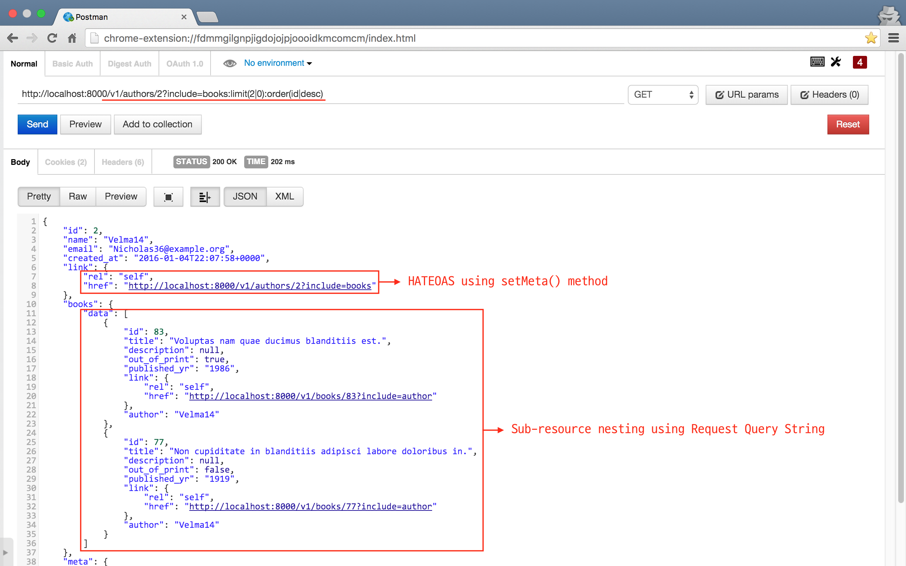

# RESTful HTTP API 컴포넌트 (라라벨/루멘用)

[](https://packagist.org/packages/appkr/api) 
[](https://packagist.org/packages/appkr/api) 
[](https://packagist.org/packages/appkr/api) 
[](https://packagist.org/packages/appkr/api)

## INDEX

-   [1. 개요](#about)
-   [2. 특징](#goal)
-   [3. 구현 예제](#example)
-   [4. 설치 방법](#install)
-   [5. 설정](#config)
-   [6. 트랜스포머](#transformer)
-   [7. 하위 리소스 포함](#nesting)
-   [8. 응답 필드 선택](#partial)
-   [9. API](#method)
-   [10. 포함된 예제 프로젝트](#example)
-   11. 라이선스와 기여

---

<a name="about"></a>
## 1. 개요

라라벨, 루멘 프레임워크로 RESTful API 서비스를 만들 때 필요한 기능들을 엮어서 만든 초경량 컴포넌트다. 

<a name="goal"></a>
## 2. 특징

1.  `league/fractal` 컴포넌트를 라라벨 또는 루멘에서 쓸 수 있도록 서비스 프로바이더를 제공한다.
2.  컴포넌트의 동작을 제어할 수 있는 전역 설정을 제공한다.
3.  API 응답 본문을 쉽게 트랜스폼/직렬화할 수 있다.
4.  트랜스포머 클래스의 뼈대 코드를 쉽게 만들수 있는 아티즌 명령을 제공한다.
5.  모범 사례를 엿볼 수 있는 예제 프로젝트를 포함한다.

<a name="example"></a>
## 3. 구현 사례(사용법)

### 3.1. API 엔드포인트

평상시 하던대로, 라라벨의 RESTful 리소스 라우트로 API 엔트포인트를 만든다.

```php
// app/Http/routes.php

Route::group(['prefix' => 'v1'], function () {
    Route::resource(
        'books',
        'BooksController',
        ['except' => ['create', 'edit']]
    );
});
```

루멘은 RESTful 리소스 라우트가 없다. 직접 하나씩 써야 한다. 

```php
// app/Http/routes.php

$app->group(['prefix' => 'v1'], function ($app) {
    $app->get('books', [
        'as'   => 'v1.books.index',
        'uses' => 'BooksController@index',
    ]);
    $app->get('books/{id}', [
        'as'   => 'v1.books.show',
        'uses' => 'BooksController@show',
    ]);
    $app->post('books', [
        'as'   => 'v1.books.store',
        'uses' => 'BooksController@store',
    ]);
    $app->put('books/{id}, [
       'as'   => 'v1.books.update',
       'uses' => 'BooksController@update',
   ]);
    $app->delete('books/{id}', [
       'as'   => 'v1.books.destroy',
       'uses' => 'BooksController@destroy',
   ]);
});
```

### 3.2. 컨트롤러

다음은 `/v1/books/{id}` 엔드포인트를 처리하는 컨트롤러 로직이다. `json()` helper와 트랜스포머의 사용법을 유심히 보라.

```php
// app/Http/Controllers/BooksController.php

<?php

namespace App\Http\Controllers\V1;

use App\Http\Controllers\Controller;
use App\Book;
use App\Transformers\BookTransformer;
use Illuminate\Http\Request;

class BooksController extends Controller
{
    public function index()
    {
        return json()->withPagination(
            Book::latest()->paginate(5),
            new BookTransformer
        );
    }

    public function store(Request $request)
    {
        // 입력값 유효성 검사는 다른 곳에서 한다고 가정한다.
        return json()->created(
            $request->user()->create($request->all())
        );
    }

    public function show($id)
    {
        return json()->withItem(
            Book::findOrFail($id),
            new BookTransformer
        );
    }

    public function update(Request $request, $id)
    {
        $book = Book::findOrFail($id);

        return ($book->update($request->all()))
            ? json()->success('Updated')
            : json()->error('Failed to update');
    }

    public function destroy($id)
    {
        $book = Book::findOrFail($id);

        return ($book->delete())
            ? json()->success('Deleted')
            : json()->error('Failed to delete');
    }
}
```

<a name="install"></a>
## 4. 설치 방법

### 4.1. 컴포저.

```sh
$ composer require "appkr/api: 1.*"
```

### 4.2. 서비스 프로바이더 추가

```php
// config/app.php (Laravel)

'providers'=> [
    Appkr\Api\ApiServiceProvider::class,
]
```

```php
// boostrap/app.php (Lumen)

$app->register(Appkr\Api\ApiServiceProvider::class);
```

### 4.3. [선택 사항] 설정 파일 등 복사.

```sh
# Laravel only
$ php artisan vendor:publish --provider="Appkr\Api\ApiServiceProvider"
```

복사한 설정 파일은 `config/api.php`에서 찾을 수 있다.

끝 !

<a name="config"></a>
## 5. 설정

[`config/api.php`](https://github.com/appkr/api/blob/master/src/config/api.php)

코드에 인라인 주석이 달려 있다.

<a name="transformer"></a>
## 6. 트랜스포머

### 6.1. 먹는건가요?

트랜스포머가 뭐하는 것인지, 왜 필요한지를 공부하려면 [`league/fractal` 공식 문서](http://fractal.thephpleague.com/transformers/)를 참고하라.

모델당 트랜스포머가 하나씩 있어야 한다(예: `Book` 모델에 대응되는 `BookTransformer`). 

### 6.2. 뼈대 코드 생성 명령

아티즌 명령줄을 이용하면 뼈대 코드를 빠르게 만들 수 있다.

```sh
$ php artisan make:transformer {subject} {--includes=}
# 예: php artisan make:transformer "App\Book" --includes="App\User:author,App\Comment:comments:true"
```

-   `subject`_ 트랜스포머를 만들 모델

-   `includes`_ 모델과 관계를 가진 다른 모델

    `--includes=모델,관계_메서드[,컬렉션]` 형식으로 쓴다. 세번째 인자인 컬렉션을 `true`로 지정하면, 해당 관계를 컬렉션으로 인식한다. 우리 예제에서는 `Book`과 `Comment`는 일대다(one to many), `Book`과 `Author`는 일대일(one to one) 관계를 가진다고 가정했다.
     
> **중요**
>
> 콘솔에서 따옴표 없이 역슬래시(`\`)를 쓸 때는 이중 역슬래시(`\\`)로 써야 한다.
>
> ```sh
> $ php artisan make:transformer App\\Book --includes=App\\User:author,App\\Comment:comments:true
> ```

자동 생성된 파일은 다음과 같다. 역시 인라인 주석이 전부 달려 있으니 읽어 보기 바란다.

```php
<?php
namespace App\Transformers;

use App\Book;
use Appkr\Api\TransformerAbstract;
use League\Fractal;
use League\Fractal\ParamBag;

class BookTransformer extends TransformerAbstract
{
    /**
     * URL 쿼리스트링으로 이용해서 중첩 요청할 수 있는 하위 리소스 (Book 모델에서 정의한 관계).
     * e.g. collection case -> ?include=comments:limit(5|1):order(created_at|desc)
     *      item case       -> ?include=author
     *
     * @var  array
     */
    protected $availableIncludes = [
        'author', 
        'comments',
    ];

    /**
     * Transform single resource.
     *
     * @param  \App\Book $book
     * @return  array
     */
    public function transform(Book $book)
    {
        $payload = [
            'id' => (int) $book->id,
            // ...
            'created' => $book->created_at->toIso8601String(),
            'link' => [
                 'rel' => 'self',
                 'href' => route('api.v1.books.show', $book->id),
            ],
        ];
    }

    /**
     * Include author.
     * This method is used, when an API client request /v1/books?include=author
     *
     * @param  \App\Book $book
     * @param \League\Fractal\ParamBag|null $params
     * @return  \League\Fractal\Resource\Item
     */
    public function includeAuthor(Book $book, ParamBag $params = null)
    {
        return $this->item(
            $book->author, 
            new \App\Transformers\UserTransformer($params)
        );
    }
    
    /**
     * Include comments.
     * This method is used, when an API client request /v1/books??include=comments
     *
     * @param  \App\Book $book
     * @param  \League\Fractal\ParamBag|null $params
     * @return  \League\Fractal\Resource\Collection
     */
    public function includeComments(Book $book, ParamBag $params = null)
    {
        $transformer = new \App\Transformers\CommentTransformer($params);

        $parsed = $transformer->getParsedParams();

        $comments = $book->comments()
            ->limit($parsed['limit'])
            ->offset($parsed['offset'])
            ->orderBy($parsed['sort'], $parsed['order'])
            ->get();

        return $this->collection($comments, $transformer);
    }
}
```

<a name="nesting"></a>
## 7. 하위 리소스 포함

클라이언트가 현재 요청하는 리소스에 대한 응답에 포함할 하위 리소스를 지정할 수 있다. 다음 URL 요청은 `/author` 엔드포인트로 저자 정보를 요청하는데, 저자의 책 목록을 id 내림차순으로 정렬했을 때, 0개를 건너뛰고 총 3개의 정보도 같이 받겠다는 의미다.    

```HTTP
GET /authors?include=books:limit(3|0):sort(id|desc)
```

여러 개의 하위 리소스를 요청할 때는 다음 처럼 한다.

```HTTP
GET /authors?include[]=books:limit(2|0)&include[]=comments:sort(id|asc)

# or alternatively

GET /authors?include=books:limit(2|0),comments:sort(id|asc)
```

하위의 하위 리소스를 요청할 때는 점(`.`)을 이용할 수 있다. 이 예제에서 `PublisherTransformer`는 `somethingelse` 관계를 가지고 있다고 가정한다.

```HTTP
GET /books?include=author,publisher.somethingelse
```

<a name="partial"></a>
## 8. 응답 필드 선택

클라이언트가 응답으로 받고 싶은 필드를 정의한다.

다음 예제는 저자의 id, name, email 정보만 받겠다는 요청이다. 그리고, 해당 저자의 책 목록 3건을 같이 요청하는데, id, title, published_at 필드만 요청하고 있다.

```HTTP
GET /authors?fields=id,name,email&include=books:limit(3|0):fields(id|title|published_at)
```

하위 리소스 요청에서의 필드 구분자는 콤마대신 파이프(`|`) 기호를 쓴다.

<a name="method"></a>
## 9. APIs

`Appkr\Api\Http\Response` 클래스의 메서드 및 helper 함수 목록이다. 이 함수와 메서드들을 이용해서 컨틀롤러에서 JSON 응답을 반환할 수 있다.

### 9.1. `Appkr\Api\Response` 메서드

```php
// JSON을 응답한다. 
// 이 클래스의 모든 메서드가 이 메서드를 사용하여 최종 JSON 응답을 반환한다.
respond(array $payload);

// 리소스 컬렉션을 트랜스폼하고 JSON 형식으로 응답한다.
// 두번 째 인자($transformer)가 없으면 일반 배열로 트랜스폼한다.
withCollection(
    \Illuminate\Database\Eloquent\Collection $collection, 
    \League\Fractal\TransformerAbstract|null $transformer, 
    string|null $resourceKey // for JsonApiSerializer only
);

// 리소스 인스턴스를 트랜스폼하고 JSON 형식으로 응답한다.
withItem(
    \Illuminate\Database\Eloquent\Model $model, 
    \League\Fractal\TransformerAbstract|null $transformer, 
    string|null $resourceKey // for JsonApiSerializer only
);

// 페이지네이터 컬렉션을 트랜스폼하고 JSON 형식으로 응답한다.
withPagination(
    \Illuminate\Contracts\Pagination\LengthAwarePaginator $paginator, 
    \League\Fractal\TransformerAbstract|null $transformer, 
    string|null $resourceKey // for JsonApiSerializer only
);

// 성공 응답.
// api.php provides configuration capability
success(string|array $message);

// 201 응답.
// 인자로 엘로퀀트 모델을 넘기면, 자동으로 배연로 트랜스폼하고 JSON 형식으로 응답한다.
created(string|array|\Illuminate\Database\Eloquent\Model $primitive);

// 204 응답.
noContent();

// 304 응답.
notModified();

// 에러 응답.
// 다른 에러 응답들이 이 메서드에 의존한다.
// \Exception 인스턴스를 인자로 넘기면, HTTP 응답 코드를 자동으로 추측한다.
error(string|array|\Exception|null $message);

// 401 응답.
unauthorizedError(string|array|null $message);

// 403 응답.
forbiddenError(string|array|null $message);

// 404 응답.
notFoundError(string|array|null $message);

// 405 응답.
notAllowedError(string|array|null $message);

// 406 응답.
notAcceptableError(string|array|null $message);

// 409 응답.
conflictError(string|array|null $message);

// 410 응답.
goneError(string|array|null $message);

// 422 응답.
unprocessableError(string|array|null $message);

// 500 응답.
internalError(string|array|null $message);

// 응답에서 HTTP 상태 코드를 설정한다. 뒤에 ->success() 등 이 클래스의 메서드를 더 체인할 수 있다.
setStatusCode(int $statusCode);

// 응답 헤더를 설정한다. 역시 체인 할 수 있다.
// This method is chain-able
setHeaders(array $headers);

// 응답 본문에 메타 데이터를 추가한다. 체인할 수 있다.
setMeta(array $meta);
```

### 9.2. `Appkr\Api\TransformerAbstract` 메서드

```php
// 트랜스포머가 해석한 URL 쿼리 파라미터의 값을 얻을 수 있다.
// 예제는 BookTransformer의 코드이므로, books 리소스에 대한 쿼리 파라미터만 취급한다. 
// 
// e.g. GET /v1/author?include[]=books:limit(2|0):fields(id|title|published_at)&include[]=comments:sort(id|asc)
//      $transformer = new BookTransformer;
//      $transformer->get(); 
// 
//      // [
//      //     'limit'  => 2
//      //     'offset' => 0
//      //     'sort'   => 'created_at'
//      //     'order'  => 'desc'
//      //     'fields' => ['id', 'title', 'published_at']
//      // ]
//
// get() 메서드 안에 쿼리 필드 이름을 넣어서 하나의 값만 얻을 수도 있다. 
//      $transformer->get('limit');
// 
//      // 2
get(string|null $key)

// get() 메서드와 같다. 가독성을 위한 래퍼 메서드다.
getParsedParams(string|null $key)
```

### 9.3. `helpers.php`

```php
// 인자를 넘기면 JSON 응답을 만든다.
// 인자가 없으면 Appkr\Api\Http\Response 인스턴스를 반환한다.
json(array|null $payload)

// 현재 프레임워크가 라라벨인지 확인한다.
is_laravel();

// 현재 프레임워크가 루멘인지 확인한다.
is_lumen();

// 현재 요청이 API 요청인지 확인한다.
is_api_request();

// 업데이트 요청인지 확인한다.
is_update_request();

// 삭제 요청인지 확인한다.
is_delete_request();
```

<a name="example"></a>
## 10. 포함된 예제 프로젝트

이 컴포넌트는 RESTful API 모범 사례를 담은 예제 프로젝트를 담고 있다. 다음은 포함된 내용이다.

-   데이터베이스 마이그레이션과 시딩
-   라우트 정의, 엘로퀀트 모델과 컨틀롤러
-   폼리퀘스트 *(Laravel only)*
-   트랜스포머
-   통합 테스트

예제 프로젝트를 사용하려면 다음 가이드를 따른다.

### 10.1. 예제 프로젝트 활성화

파일을 열어 다음 주석을 제거한다.

```php
// vendor/appkr/api/src/ApiServiceProvider.php

$this->publishExamples();
```

### 10.2. 마이그레이션과 시딩

콘솔에서 다음 명령을 수행한다. 현재 프로젝트의 기본 DB를 오염시키지 않기 위해서 SQLite를 쓸 것을 권장한다.

```sh
$ php artisan migrate --path="vendor/appkr/api/src/example/database/migrations" --database="sqlite"
$ php artisan db:seed --class="Appkr\Api\Example\DatabaseSeeder" --database="sqlite"
```

### 10.3. 확인

PHP 내장 웹 서버(또는 다른 웹 서버)를 실행한다.

```sh
$ php artisan serve
```

`GET /v1/books` 열면 다음 그림과 같은 API 응답을 볼 수 있다. `/v1/books=include=authors`, `/v1/authors=include=books:limit(2|0):order(id|desc)` 등도 실험해 보라.



### 10.4. [선택 사항] 통합 테스트

```sh
# Laravel
$ vendor/bin/phpunit vendor/appkr/api/src/example/BookApiTestForLaravel.php
```

```sh
# Lumen
$ vendor/bin/phpunit vendor/appkr/api/src/example/BookApiTestForLumen.php
```

> **`중요`** 
> 
> 테스트가 끝났으면 1단계에서 풀었던 주석을 다시 살려둔다.

## 11. 라이선스와 기여

[MIT ](https://raw.githubusercontent.com/appkr/api/master/LICENSE) 라이선스. 이슈와 PR은 언제든 환영한다.
